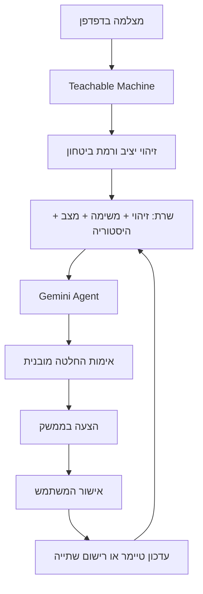

# Smart Desk · מקום להתרכז

אפליקציית לימוד בעברית וב־RTL: מצלמה מזהה חפצים בשולחן, Agent בוחן את הזיהוי ואת מצב הסשן ומציע פעולה. המשתמש מאשר לפני שהטיימר מושהה או משתנה.

## מצב הפרויקט

האפליקציה פורסמה ב־Vercel והמאגר ציבורי. ב־16.09.2026 נבדקה גישה ללא התחברות וקריאת שרת אמיתית ל־Gemini עם קלט זיהוי סינתטי; המשתמש אישר בדיקה מוצלחת של האתר הציבורי ושל השימוש בטלפון. אין בדיווח זה מדידת דיוק לכל קטגוריה או אישור נפרד לכל תרחיש שגיאה. מצב הדגמה אינו תחליף ל־Agent בהגשת הקורס.

- [האתר הפעיל](https://smart-desk-agent-vert.vercel.app/)
- [מאגר GitHub](https://github.com/oritark/smart-desk-agent)


## הרעיון

המטרה היא לעזור להשלים משימת לימוד במינימום הפרעות. זיהוי טלפון בזמן לימוד עשוי להוביל להצעה להשהות את הטיימר; מחברת לפני תחילת הסשן עשויה להוביל להצעה להתחיל; בקבוק עשוי להוביל לתזכורת שתייה בהתאם לזמן האישור האחרון. אותו חפץ לא בהכרח גורר אותה פעולה בכל מצב.

## מודל Teachable Machine

- סוג: Standard Image Project, סיווג תמונה (לא תיבות זיהוי של מספר חפצים).
- [קישור למודל](https://teachablemachine.withgoogle.com/models/q3YTZOQtb/).
- קטגוריות: `PHONE`, `NOTEBOOK`, `WATER BOTTLE`, `PAPER`, `NO OBJECT`.
- באימון הראשוני: 74 תמונות טלפון, 37 מחברת, 33 בקבוק, 161 דף, 31 ללא חפץ.
- יש לבדוק תמונות חדשות, זוויות ותאורה שונות; במיוחד את ההבחנה בין מחברת לדף. מספר הדוגמאות אינו מאוזן, ואין כאן טענה לדיוק כולל שנמדד.
- המודל רץ בדפדפן באמצעות TensorFlow.js וספריית Teachable Machine. הצילום נחתך לריבוע מרכזי בדומה לתצוגת האימון.
- קריאה אוטומטית ל־Agent מחייבת ביטחון של לפחות 85% במשך 1.5 שניות, 30 שניות בין קריאות, ולפחות 2 דקות בין קריאות אוטומטיות לאותה קטגוריה. אין קריאות חדשות בזמן הצעה ממתינה.

## ה־Agent

- **Goal:** לעזור להשלים סשן לימוד ממוקד, תוך שמירת שליטה בידי המשתמש.
- **Input:** תווית החפץ ורמת ביטחון ממודל המצלמה.
- **Context / State:** המשימה, מצב הטיימר, הזמן שעבר, הזמן שנותר, מועד השתייה האחרון ועד 8 פעולות אחרונות (לרבות דחיות).
- **Decision:** Gemini מחזיר JSON מובנה. השרת מאמת שהתשובה תקינה והפעולה מותרת במצב הנוכחי.
- **Action:** האפליקציה מציגה הצעה. רק אישור מפעיל `START_FOCUS`, `PAUSE_FOCUS`, `RESUME_FOCUS`, `DRINK_WATER` או `TAKE_BREAK`. `CONTINUE` מעדכן את כרטיס המשוב בלי לשנות את הטיימר.
- תשובה ישנה נפסלת אם המשתמש שינה את הסשן במהלך ההמתנה.



## טכנולוגיות ומבנה

HTML, CSS, JavaScript modules, Node.js 22+, Gemini REST API, TensorFlow.js, Teachable Machine, GitHub ו־Vercel. אין צורך בתהליך build או התקנת חבילות עבור השרת המקומי.

```text
public/index.html     ממשק עברי נגיש ורספונסיבי
public/styles.css     עיצוב בהיר בכחול וירוק
public/app.js         מצלמה, ממשק, מצב וחיבור שרת
public/logic.js       טיימר, פעולות, סינון והדגמה
api/agent.js          פונקציית שרת Vercel ו־Gemini
server.mjs            שרת פיתוח מקומי
tests/agent.test.mjs   בדיקות התנהגות ואינטגרציה עם תעבורה מדומה
vercel.json           הגדרות פרסום
```

## הפעלה מקומית

נדרש Node.js בגרסה 22 ומעלה.

1. העתק `.env.example` לקובץ `.env.local`.
2. הגדר בו `GEMINI_API_KEY` באופן מקומי בלבד. המודל המוגדר כברירת מחדל הוא `gemini-3.5-flash-lite`; אפשר לשנות באמצעות `GEMINI_MODEL` בהתאם לגישה ולמכסה בחשבון.
3. הרץ `node --env-file-if-exists=.env.local server.mjs` (או `npm run dev`).
4. פתח `http://localhost:3000`.
5. הרץ `node --test tests/*.test.mjs` לבדיקות.

בלי מפתח: הטיימר והמצלמה זמינים, והודעה מסבירה שהחיבור ל־AI טרם הוגדר. מצב הדגמה מפעיל כללים מקומיים וזיהויים מדומים ומסומן בכל המלצה ובהיסטוריה. אין מעבר אוטומטי להדגמה במקרה של שגיאת Gemini.

## פרסום ב־Vercel

1. ייבא את מאגר GitHub ב־Vercel.
2. Framework Preset: `Other`. תיקיית שורש: שורש המאגר. Output Directory: `public`. אין צורך ב־Build Command.
3. הוסף `GEMINI_API_KEY` כמשתנה סביבה בצד השרת ב־Production (וגם Preview אם רוצים בדיקות בענפים). ניתן להוסיף `GEMINI_MODEL`.
4. בצע Deploy. לאחר שינוי משתנה סביבה יש לפרוס מחדש.
5. פתח את כתובת HTTPS, אפשר מצלמה ובדוק את הזרימה האמיתית. המפתח לא אמור להופיע בקוד, בתגובות ה־API או ברשת הדפדפן.

האתר שומר משימה, מצב טיימר ועד 30 רשומות היסטוריה ב־localStorage במכשיר. היסטוריה אחרונה של עד 6 רשומות מוצגת בממשק. מצלמה אינה מופעלת אוטומטית ומפסיקה כאשר עוזבים את הלשונית. הטיימר מבוסס על זמן סיום ולכן ממשיך למדוד נכון גם כשהלשונית אינה פעילה. פעולת סיום אינה דורשת מצלמה.

## אבטחה וגבולות

המפתח נמצא בשרת בלבד. אין שידור תמונות ל־Gemini; כן נשלחים שם המשימה, הזיהוי ומצב הסשן. טקסט מהמשתמש או מ־AI מוצג כטקסט ולא כ־HTML. השרת מגביל אורך קלט, מאמת את הפעולות, מסנן מקור דפדפן זר ומגדיר timeout. הגבלת הבקשות בזיכרון היא בסיסית ולכל מופע שרת בלבד; אינה הגנה גלובלית מהתעללות באתר ציבורי. לפני חשיפה רחבה יש להוסיף הגבלות בקצה/אימות ולנהל מכסות בשירות AI. הסטטוס configured בודק נוכחות מפתח, לא את תקפותו.

## אתגרים

- מניעת זיהוי חוזר בכל פריים ושליחת קריאות מיותרות.
- סיווג דף לעומת מחברת, ואיסוף דוגמאות מאוזנות יותר.
- שמירת שליטת המשתמש בטיימר גם כאשר AI מציע שינוי.
- ביטול המלצה ישנה אחרי שינוי מצב, ושמירת זמן בעת מעבר להפסקה.
- הרשאות מצלמה והתנהגות בדפדפנים ניידים.

## בדיקה והגשה

- [ ] בדיקת המצלמה עם כל חמש הקטגוריות, לרבות ללא חפץ, במחשב ובטלפון אמיתי.
- [ ] קריאת Gemini אמיתית באתר הפרוס והפעלת פעולה לאחר אישור.
- [ ] בדיקת דחייה: הטיימר ממשיך.
- [ ] בדיקת סירוב למצלמה, שגיאת רשת ומכסה חסרה.
- [ ] צילומי מסך של האימון ושל האפליקציה עם זיהוי, החלטה ופעולה.
- [x] קישור האתר וקישור המאגר.
- [ ] סרטון 30–120 שניות של האתר הפרוס: הרעיון, זיהוי אמיתי, החלטת Gemini ואישור פעולה.

צילום האימון המקורי נשמר מקומית ואינו מתפרסם אוטומטית, מאחר שהוא עשוי לכלול תמונות מצלמה. אין להשתמש במצב הדגמה כראיה לזיהוי אמיתי או לחיבור Gemini.
